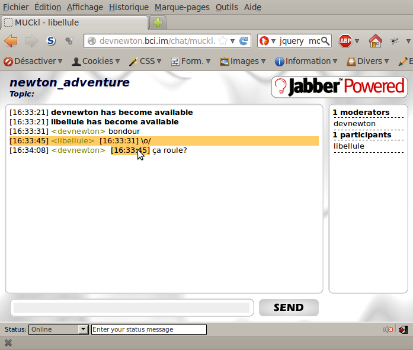
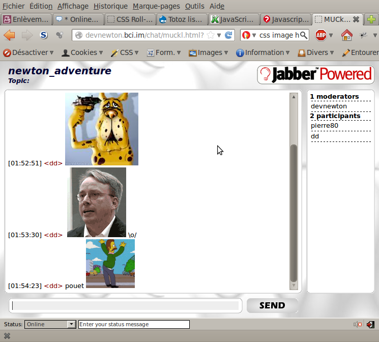

MUCkl tribune 
=============

A special version of MUCkl with tribune features.

What is MUCkl ?
===============

  MUCkl is a web based groupchat application with focus on ease of
  installation and usage. As a user you just need to enter your
  desired nickname and start chatting.
  MUCkl doesn't need Perl, PHP or MySQL at the server side nor Java at
  the client side. It's just plain HTML/JavaScript.

  MUCkl uses [1]Jabber technology to handle all communication. It
  let's you connect to any predefined [2]MUC-based chat room.

  This version 

  [1] http://www.jabber.org
  [2] http://www.jabber.org/jeps/jep-0045.html

What is a tribune?
==================

A tribune is a type of chat popular in some obscure french websites.

It adds to traditionnal chat some usefull features:

- norloge: a conversation flow highlightning tool.
- totoz: a way to insert stupid images.

Screenshots
===========

Supported browsers and plattforms
=================================

  As of this release MUCkl has not been tested a lot. It should work
  with any version of Internet Explorer since version 5 and all recent
  versions of Gecko ("Mozilla") based browsers. 

  Feedback on this is very welcome!

Prerequisites
=============

  In order to use MUCkl you need to have access to an [3]HTTP Polling
  or [4]HTTP Binding service for Jabber. These allow you to connect to
  a Jabber server using the HTTP protocol rather than raw TCP/IP
  sockets. There are Jabber servers that have built-in HTTP Polling
  support like [5]ejabberd or some of the commercial ones.

  There are also some standalone implementations of HTTP Polling
  available like [6]tonneru and [7]webjah. Both allow you to connect
  to any jabber server. Latest versions of punjab have built in
  support for HTTP Polling and HTTP Binding. See [8]punjab's website for
  details.

  Additionally you need a web server of your choice capable of doing
  address rewriting (at least if you're using an HTTP proxy service
  that is not local to your web server).

  So to sum it up: If you don't know of any public jabber server which
  offers HTTP Polling as a free service, you will have to install your
  own jabber server or one of the HTTP Polling components mentioned
  above. If you've got the choice use ejabberd as it's the most
  reliable solution available at the moment at no cost.

  [3] http://www.jabber.org/jeps/jep-0025.html
  [4] http://www.jabber.org/jeps/jep-0124.html
  [5] http://ejabberd.jabberstudio.org
  [6] http://tonneru.tanoshi.net/
  [7] http://www.gonzo.kiev.ua/projects/jabber/index.html#webjah
  [8] http://punjab.sourceforge.net/

Installation
============

  1) Unpacking

     Unpack MUCkl into a directory accessible by your web server.

  2) Configure Web Server

     This is the trickiest part of the setup as it depends on which
     HTTP Polling service you've chosen. It requires some knowledge of
     apache configuration as well as some understanding of what HTTP
     Polling is.

     First let me explain, what we need to do and why: Due to security
     considerations most browsers don't allow JavaScript to access any
     data outside the domain it has been loaded from. Gecko based
     browsers are even more restrictive in this as they don't allow
     them to access data on a different port either.

     So say, the HTTP Polling service we plan to use for MUCkl is
     located at http://jabber.somedomain.com:5280/http-poll/ (a
     typical ejabberd URI). MUCkl itself is served at
     http://www.mydomain.com/MUCkl/. Now we have to make sure that our
     installation of MUCkl can access the HTTP Polling service by
     calling some local URI like
     http://www.mydomain.com/http-poll/. So we have to
     setup a rewrite rule which redirects requests on
     http://www.mydomain.com/MUCkl/http-poll/ to
     http://jabber.somedomain.com:5280/http-poll/.

     Using apache this can be achieved by the following steps:

     * Make sure that mod_rewrite and mod_proxy (additionally
       mod_proxy_http for apache2) are loaded.

     * Define a rewrite rule for your MUCkl installation directory (Step 1). 
       E.g. create an .htaccess file within your MUCkl installation
       directory like the following:

       <IfModule mod_rewrite.c>
         RewriteEngine On
         RewriteRule http-poll/ http://jabber.somedomain.com:5280/http-poll/ [P]
       </IfModule>

  3) Setup Jabber Account

     In order to complete Step 3 and 4 you will need a native Jabber
     client that supports registration of new accounts and the MUC
     protocol for configuration of your chat room. My tip: Use Exodus
     on Windows, tkabber on Linux.

     Now you need to create a new jabber account. Make sure that you
     can connect to it by way of the chosen HTTP Polling service. So
     most probably using the example above you would create it on
     jabber.somedomain.com.

     Everybody using your installation of MUCkl will use this account
     data to enter the Jabber network and join your chat room.

  4) Setup Chat Room

     Now use some different Jabber account which will be the owner of
     your desired chat room. Enter your room or create a new one and
     configure it to suit your needs (e.g. don't make it
     private/invite only/password protected, as MUCkl doesn't support
     these kind of things).

  5) Configure MUCkl

     Now that we have all necessary data at hand we finally may edit
     config.js (located in MUCkl's installation directory). For
     detailed information on how to do this refer to the comments
     given in this file!

     When done, fire up your prefered browser (see above! ;-)) and
     login to MUCkl.

Further Information/Reading
===========================

  MUCkl is a stripped down version of [9]JWChat - a web based Jabber
  client. As such it uses the [10]JSJaC library for communication with
  the Jabber network. JSJaC allows you to connect to Jabber servers
  using either [11]HTTP Polling or [12]HTTP Binding. Groupchat
  functionality is realized as an implementation of the [13]Multi User
  Conference Protocol [MUC].

  [9] http://jwchat.sourceforge.net
  [10] http://jsjac.jabberstudio.org
  [11] http://www.jabber.org/jeps/jep-0025.html
  [12] http://www.jabber.org/jeps/jep-0124.html
  [13] http://www.jabber.org/jeps/jep-0045.html

Disclaimer
==========

  This program is free software; you can redistribute it and/or modify
  it under the terms of the GNU General Public License as published by
  the Free Software Foundation; either version 2 of the License, or
  (at your option) any later version.

  This program is distributed in the hope that it will be useful, but
  WITHOUT ANY WARRANTY; without even the implied warranty of
  MERCHANTABILITY or FITNESS FOR A PARTICULAR PURPOSE.  See the GNU
  General Public License for more details.

  You should have received a copy of the GNU General Public License
  along with this program; if not, write to the Free Software
  Foundation, Inc., 59 Temple Place, Suite 330, Boston, MA 02111-1307
  USA

